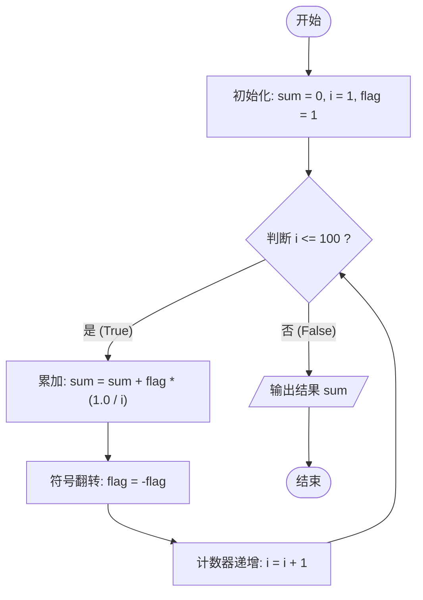

# 循环求解

求并把流程图画出来，需要输出结果截图， 算法（程序代码）

```mermaid
graph TD
    A([开始]) --> B["初始化: sum = 0, i = 1, flag = 1"]
    B --> C{"判断 i <= 100 ?"}
    C -- 是 (True) --> D["累加: sum = sum + flag * (1.0 / i)"]
    D --> E["符号翻转: flag = -flag"]
    E --> F["计数器递增: i = i + 1"]
    F --> C
    C -- 否 (False) --> G[/输出结果 sum/]
    G --> H([结束])
```
